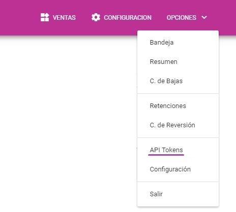
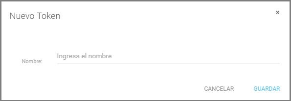
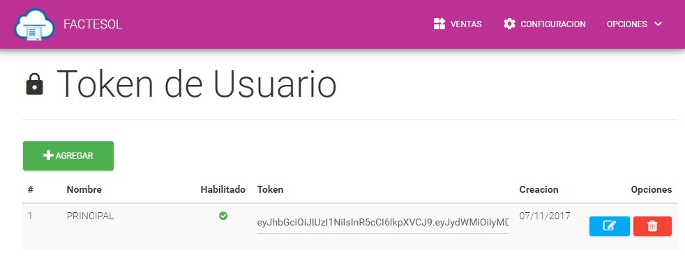

Tutoriales
==========
Lista de Tutoriales.

Como crear un token
--------------------

.. warning:: Puede crear muliples tokens que no tienen fecha de expiración, puede eliminarlo o suspenderlo temporalmente en que caso sea necesario

Para crear un token dirijase a la opción de ``Opciones > API Tokens``

Click en el boton ``Agregar`` y en la vetana que le aparecerá podrá darle un nombre referencial al token.

Luego podra visualizar los tokens que ha creado.

Continuar con la sección :doc:`examples`

Obtener el codigo Hash
----------------------

.. code-block:: csharp
    :emphasize-lines: 18

    var token = "UN-TOKEN-VALIDO";
    var txt = "{\"Ruc\": \"20600055519\", \"TipoDocumento\": \"01\", \"Serie\": \"F001\", \"Correlativo\": \"1\"}";

    var http = (HttpWebRequest)WebRequest.Create("https://factesol.net.pe/api/venta/hash");
    http.Method = "POST";
    http.ContentType = "application/json";
    http.Headers.Add("Authorization", "Bearer " + token);
    var content = Encoding.UTF8.GetBytes(txt);
    http.ContentLength = content.Length;
    using (var wr = http.GetRequestStream())
    {
        wr.Write(content, 0, content.Length);
    }

    var resp = (HttpWebResponse)http.GetResponse();
    if (resp.StatusCode == HttpStatusCode.OK)
    {
        using (var reader = new System.IO.StreamReader(resp.GetResponseStream()))
        {
            string hash = reader.ReadToEnd();
            Console.WriteLine("Hash: " + hash);
        }
    }

Obtener el codigo Qr
---------------------

.. code-block:: csharp
    :emphasize-lines: 18

    var token = "UN-TOKEN-VALIDO";
    var txt = "{\"Ruc\": \"20600055519\", \"TipoDocumento\": \"01\", \"Serie\": \"F001\", \"Correlativo\": \"1\"}";

    var http = (HttpWebRequest)WebRequest.Create("https://factesol.net.pe/api/venta/code-qr");
    http.Method = "POST";
    http.ContentType = "application/json";
    http.Headers.Add("Authorization", "Bearer " + token);
    var content = Encoding.UTF8.GetBytes(txt);
    http.ContentLength = content.Length;
    using (var wr = http.GetRequestStream())
    {
        wr.Write(content, 0, content.Length);
    }

    var resp = (HttpWebResponse)http.GetResponse();
    if (resp.StatusCode == HttpStatusCode.OK)
    {
        using (var stream = resp.GetResponseStream())
        {
            // imagen en la respuesta
        }
    }
